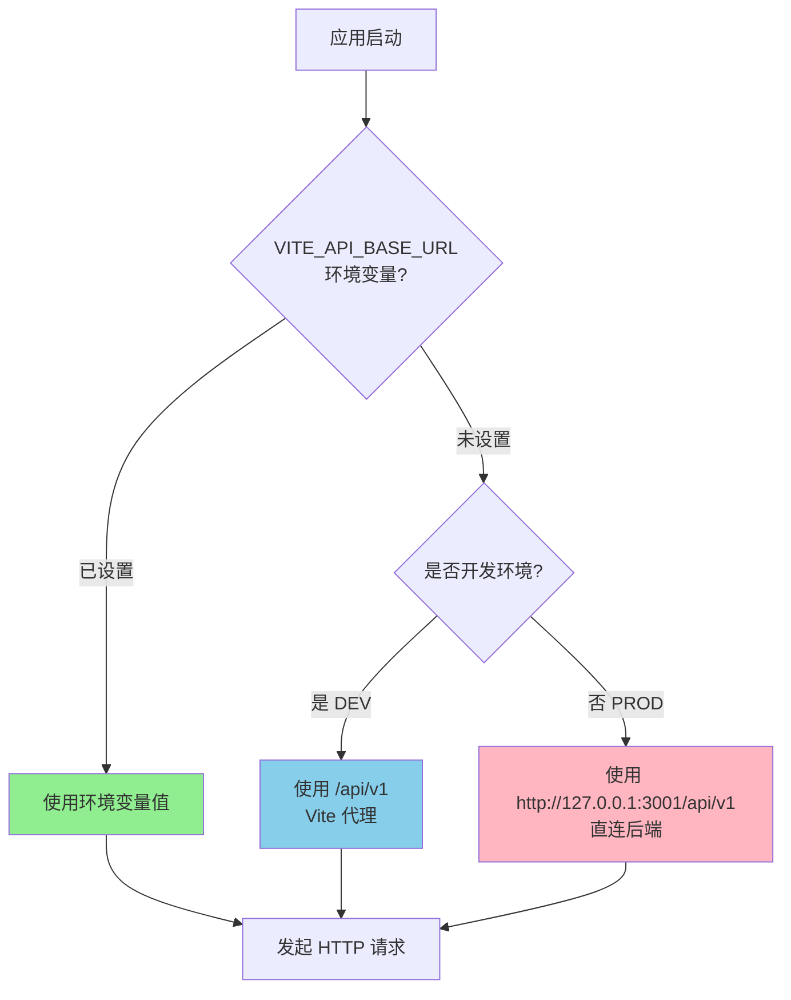
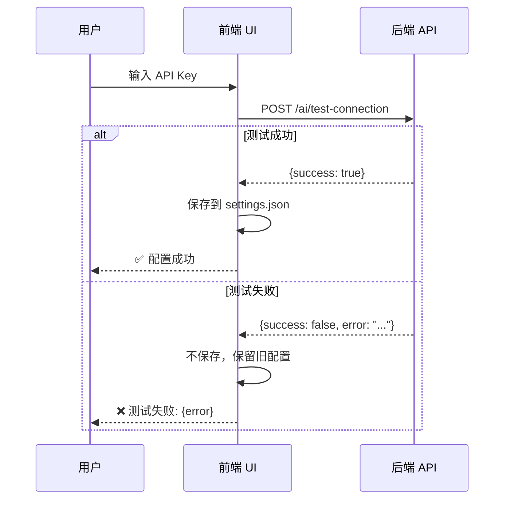

# AI Proxy 行为与部署说明

**最后更新**: 2026-04-21  
**版本**: 1.0

---

## 概述

本文档说明前端与后端通信的代理行为、不同环境的配置策略、错误处理规范和风险点。

---

## API Base URL 决策逻辑

### 配置优先级

```typescript
// src/config/python-api.config.ts

const API_BASE_URL = (() => {
  // 1. 环境变量（最高优先级）
  const fromEnv = import.meta.env.VITE_API_BASE_URL?.trim();
  if (fromEnv) return fromEnv.replace(/\/$/, '');
  
  // 2. 开发环境：使用 Vite 代理
  if (import.meta.env.DEV) return '/api/v1';
  
  // 3. 生产环境：直连本机后端
  return 'http://127.0.0.1:3001/api/v1';
})();
```

### 决策流程图



---

## 环境行为说明

### Development（开发环境）

**配置**:
```bash
# .env.development（可选）
VITE_API_BASE_URL=/api/v1
```

**行为**:
- 前端运行在 `http://localhost:5173`（Vite dev server）
- API 请求发送到 `/api/v1/*`
- Vite 代理将请求转发到 `http://127.0.0.1:3001/api/v1/*`
- **无需配置 CORS**（同源请求）

**Vite 代理配置** (`vite.config.ts`):
```typescript
export default defineConfig({
  server: {
    proxy: {
      '/api/v1': {
        target: 'http://127.0.0.1:3001',
        changeOrigin: true,
      },
    },
  },
});
```

**优点**:
- 无需处理跨域问题
- 热更新快速
- 便于调试

**注意事项**:
- 确保 Python 后端已启动（`npm run python-backend`）
- 代理仅在开发时有效

---

### Production Desktop（桌面应用生产环境）

**配置**:
```bash
# 无特殊配置，使用默认值
# API_BASE_URL = 'http://127.0.0.1:3001/api/v1'
```

**行为**:
- 前端构建为静态文件（`dist/` 目录）
- 通过 Tauri/Electron 等框架打包为桌面应用
- API 请求直接发送到 `http://127.0.0.1:3001/api/v1/*`
- **需要配置 CORS**（如果后端和前端不在同一进程）

**CORS 配置** (后端 `main.py`):
```python
from fastapi.middleware.cors import CORSMiddleware

app.add_middleware(
    CORSMiddleware,
    allow_origins=["*"],  # 桌面应用可放宽限制
    allow_credentials=True,
    allow_methods=["*"],
    allow_headers=["*"],
)
```

**优点**:
- 性能最优（无代理开销）
- 可离线运行（如果后端打包在内）

**注意事项**:
- 用户需手动启动 Python 后端
- 或提供一键启动脚本（`start.bat` / `start.ps1`）
- 端口 3001 不能被占用

---

### Production Web（Web 部署）

**配置**:
```bash
# .env.production
VITE_API_BASE_URL=https://api.example.com/api/v1
```

**行为**:
- 前端部署到 CDN 或静态托管服务
- 后端部署到独立服务器
- API 请求发送到配置的远程地址
- **必须配置 CORS**

**部署要求**:
1. **后端服务器**:
   - 配置 HTTPS（推荐）
   - 设置正确的 CORS 白名单
   - 启用认证机制（JWT/API Key）

2. **前端服务器**:
   - 配置 SPA fallback（所有路由指向 index.html）
   - 启用缓存策略

3. **网络**:
   - 确保防火墙允许跨域请求
   - 配置负载均衡（如果需要）

**示例 Nginx 配置**:
```nginx
# 前端
server {
    listen 80;
    server_name app.example.com;
    root /var/www/frontend;
    
    location / {
        try_files $uri $uri/ /index.html;
    }
}

# 后端 API
server {
    listen 80;
    server_name api.example.com;
    
    location / {
        proxy_pass http://127.0.0.1:3001;
        proxy_set_header Host $host;
        proxy_set_header X-Real-IP $remote_addr;
    }
}
```

---

## 错误提示规范

### 错误分类

#### 1. 网络连接错误

**触发条件**:
- 后端服务未启动
- 网络中断
- 防火墙阻止

**错误消息**:
```
无法连接后端（http://127.0.0.1:3001）。
请在 src-python 目录执行 python run.py，或使用 npm run python-backend。
```

**UI 展示**:
- ❌ 红色错误横幅
- 提供"重试"按钮
- 显示排查步骤链接

**代码实现**:
```typescript
catch (error: unknown) {
  const msg = error instanceof Error ? error.message : String(error);
  const m = msg.toLowerCase();
  
  if (
    m.includes('failed to fetch') ||
    m.includes('networkerror') ||
    m.includes('load failed')
  ) {
    throw new Error(
      '无法连接后端（http://127.0.0.1:3001）。' +
      '请在 src-python 目录执行 python run.py，或使用 npm run python-backend。'
    );
  }
  
  throw error;
}
```

---

#### 2. LLM 超时错误

**触发条件**:
- LLM API 响应超过 60 秒
- 网络延迟过高

**错误消息**:
```
LLM 调用超时（60秒）。请检查：
1. 网络连接是否正常
2. API Key 是否有效
3. 模型服务商是否有故障
```

**UI 展示**:
- ⏱️ 橙色警告
- 提供"切换到宽松模式"按钮（允许规则引擎回退）

---

#### 3. 认证错误

**触发条件**:
- API Key 无效或过期
- Token 失效

**错误消息**:
```
AI 服务认证失败。请检查：
1. API Key 是否正确
2. 账户余额是否充足
3. 是否在 AI 设置中配置了模型
```

**UI 展示**:
- 🔑 黄色提示
- 提供"打开 AI 设置"按钮
- 高亮显示配置输入框

---

#### 4. 后端业务错误

**触发条件**:
- Skill 不存在
- 参数验证失败
- 执行逻辑错误

**错误消息**:
```
执行失败: {后端返回的错误详情}

建议操作:
- 检查任务描述是否清晰
- 确认 SSH 连接已建立
- 查看日志获取更多信息
```

**UI 展示**:
- 📋 可展开的错误详情
- 提供"查看日志"链接
- 提供"报告问题"按钮

---

## 配置回滚逻辑

### API Key 配置

**原则**: 测试通过前不保存

**流程**:


**实现**:
```typescript
async saveAiConfig(config: AiConfig) {
  // 1. 先测试连接
  const testResult = await this.testAiConnection(config);
  
  if (!testResult.success) {
    // 2. 测试失败，不保存
    throw new Error(`连接测试失败: ${testResult.error}`);
  }
  
  // 3. 测试成功，保存配置
  await this.saveSettings({ ai: config });
  
  // 4. 提供回滚选项
  this.showNotification('配置已保存', {
    action: '撤销',
    onAction: () => this.rollbackAiConfig(),
  });
}
```

---

### 恢复默认配置

**功能**: 一键恢复到出厂设置

**实现**:
```typescript
async resetToDefaults() {
  const confirmed = await confirmDialog(
    '确定要恢复默认配置吗？这将清除所有自定义设置。'
  );
  
  if (confirmed) {
    const defaultSettings = getDefaultSettings();
    await this.saveSettings(defaultSettings);
    showNotification('已恢复默认配置');
    location.reload(); // 刷新页面应用新配置
  }
}
```

---

## 风险点说明

### 风险 1: 本地后端未启动

**影响**: 所有 API 调用失败  
**概率**: 高（新用户常见问题）  
**缓解**:
1. **启动脚本**: 提供 `start.bat` / `start.ps1` 一键启动前后端
2. **健康检查**: 应用启动时检测后端状态
3. **友好提示**: 显示清晰的错误信息和解决步骤

**检测代码**:
```typescript
async checkBackendHealth(): Promise<boolean> {
  try {
    await fetch(`${API_BASE_URL}/health`);
    return true;
  } catch {
    return false;
  }
}

// 应用启动时
if (!(await checkBackendHealth())) {
  showBackendNotRunningModal();
}
```

---

### 风险 2: API Key 泄露

**影响**: 账户被盗用，产生高额费用  
**概率**: 中（取决于存储方式）  
**缓解**:
1. **不要硬编码**: API Key 不应写入代码
2. **加密存储**: 使用系统密钥链或加密文件
3. **权限控制**: 限制 API Key 的使用范围和配额

**当前实现**:
- API Key 存储在 `settings.json`（明文）⚠️
- **改进建议**: 使用操作系统的密钥管理服务
  - Windows: Credential Manager
  - macOS: Keychain
  - Linux: Secret Service API

---

### 风险 3: 跨域问题（CORS）

**影响**: 浏览器阻止 API 请求  
**概率**: 中（Web 部署时常见）  
**缓解**:
1. **开发环境**: 使用 Vite 代理避免 CORS
2. **生产环境**: 后端正确配置 CORS 头
3. **桌面应用**: 使用 `allow_origins=["*"]`（内网安全）

**CORS 配置示例**:
```python
# 严格模式（推荐用于生产）
app.add_middleware(
    CORSMiddleware,
    allow_origins=["https://app.example.com"],  # 指定域名
    allow_credentials=True,
    allow_methods=["GET", "POST", "PUT", "DELETE"],
    allow_headers=["Content-Type", "Authorization"],
)

# 宽松模式（仅用于桌面应用或内网）
app.add_middleware(
    CORSMiddleware,
    allow_origins=["*"],
    allow_credentials=True,
    allow_methods=["*"],
    allow_headers=["*"],
)
```

---

### 风险 4: 端口冲突

**影响**: 后端无法启动  
**概率**: 低  
**缓解**:
1. **启动前检查**: 检测端口 3001 是否被占用
2. **自动选择端口**: 如果 3001 被占用，尝试 3002、3003...
3. **明确提示**: 告知用户哪个端口被占用及如何释放

**检测代码**:
```python
import socket

def is_port_in_use(port: int) -> bool:
    with socket.socket(socket.AF_INET, socket.SOCK_STREAM) as s:
        return s.connect_ex(('127.0.0.1', port)) == 0

if is_port_in_use(3001):
    print("错误: 端口 3001 已被占用")
    print("请使用以下命令查找并终止占用进程:")
    print("  Windows: netstat -ano | findstr :3001")
    print("  macOS/Linux: lsof -i :3001")
    sys.exit(1)
```

---

### 风险 5: 依赖服务不可用

**影响**: LLM API、SSH 服务等外部依赖故障  
**概率**: 中  
**缓解**:
1. **降级策略**: LLM 不可用时回退到规则引擎
2. **重试机制**: 网络波动时自动重试（最多 3 次）
3. **超时控制**: 避免无限等待

**重试实现**:
```typescript
async fetchWithRetry(url: string, options: RequestInit, retries = 3) {
  for (let i = 0; i < retries; i++) {
    try {
      return await fetch(url, options);
    } catch (error) {
      if (i === retries - 1) throw error; // 最后一次重试失败，抛出异常
      await sleep(1000 * (i + 1)); // 指数退避
    }
  }
}
```

---

## 监控与日志

### 前端日志

**记录内容**:
- API 请求URL和方法
- 响应状态码
- 耗时
- 错误堆栈

**实现**:
```typescript
class ApiLogger {
  static logRequest(method: string, url: string) {
    console.log(`[API] ${method} ${url}`);
  }
  
  static logResponse(method: string, url: string, status: number, duration: number) {
    console.log(`[API] ${method} ${url} → ${status} (${duration}ms)`);
  }
  
  static logError(method: string, url: string, error: Error) {
    console.error(`[API ERROR] ${method} ${url}`, error);
  }
}
```

### 后端日志

**记录内容**:
- 请求来源 IP
- 请求参数（脱敏）
- 执行耗时
- 异常堆栈

**配置** (`main.py`):
```python
import logging

logging.basicConfig(
    level=logging.INFO,
    format='%(asctime)s - %(name)s - %(levelname)s - %(message)s',
    handlers=[
        logging.FileHandler('api.log'),
        logging.StreamHandler(),
    ],
)
```

---

## 性能优化建议

### 1. 请求合并

**问题**: 多个小组件同时发起 API 请求  
**解决**: 使用请求去重或批量接口

```typescript
// 请求去重
const pendingRequests = new Map<string, Promise<any>>();

async function fetchWithDedup(url: string) {
  if (pendingRequests.has(url)) {
    return pendingRequests.get(url);
  }
  
  const promise = fetch(url).then(res => res.json());
  pendingRequests.set(url, promise);
  
  try {
    return await promise;
  } finally {
    pendingRequests.delete(url);
  }
}
```

### 2. 响应缓存

**问题**: 频繁请求相同数据（如 skills 列表）  
**解决**: 客户端缓存

```typescript
const cache = new Map<string, { data: any; timestamp: number }>();
const CACHE_TTL = 5 * 60 * 1000; // 5分钟

async function getCachedSkills() {
  const cached = cache.get('skills');
  if (cached && Date.now() - cached.timestamp < CACHE_TTL) {
    return cached.data;
  }
  
  const data = await fetch('/api/v1/agent/skills').then(r => r.json());
  cache.set('skills', { data, timestamp: Date.now() });
  return data;
}
```

### 3. 懒加载

**问题**: 应用启动时加载所有模块  
**解决**: 按需加载

```typescript
// 仅在需要时导入 Agent 模块
async function runAgentTask(task: string) {
  const { agentService } = await import('../modules/ai/agentService');
  return agentService.runAgentTask({ task });
}
```

---

## 故障排查清单

### 前端无法连接后端

- [ ] Python 后端是否已启动？（`ps aux | grep python`）
- [ ] 端口 3001 是否被占用？（`netstat -ano | findstr :3001`）
- [ ] 防火墙是否阻止连接？
- [ ] API_BASE_URL 配置是否正确？
- [ ] 浏览器控制台是否有 CORS 错误？

### LLM 调用失败

- [ ] API Key 是否配置？
- [ ] API Key 是否有效？
- [ ] 账户余额是否充足？
- [ ] 网络连接是否正常？
- [ ] 模型名称是否正确？

### SSH 连接失败

- [ ] SSH 服务是否运行？（`systemctl status sshd`）
- [ ] 用户名和密码是否正确？
- [ ] 防火墙是否允许 22 端口？
- [ ] SSH Key 权限是否正确？（`chmod 600 ~/.ssh/id_rsa`）

---

## 后续改进

1. **自动更新**: 检测后端版本并提供升级提示
2. **离线模式**: 缓存关键数据，支持有限离线使用
3. **多后端支持**: 允许配置多个后端实例（负载均衡）
4. **WebSocket**: 实时推送 Agent 执行进度
5. **GraphQL**: 替代 REST API，减少请求次数

---

## 参考资料

- [FastAPI CORS 文档](https://fastapi.tiangolo.com/tutorial/cors/)
- [Vite 代理配置](https://vitejs.dev/config/server-options.html#server-proxy)
- [Fetch API 最佳实践](https://developer.mozilla.org/en-US/docs/Web/API/Fetch_API/Using_Fetch)

---

**维护者**: AI Assistant  
**审核状态**: 已实施
